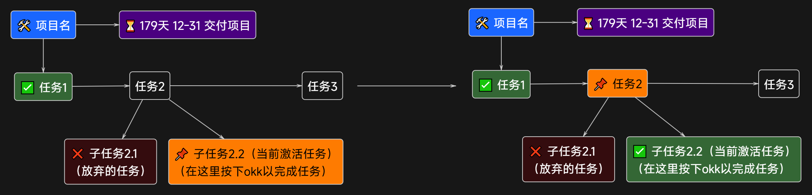

# Task Arrange

Project Graph (https://github.com/graphif/project-graph) 任务安排 & 任务加强 插件

将文本节点组织为任务树，自动高亮当前可执行的任务。

## 安装

从 [Releases](../../releases) 下载 `.prg`，拖入 Project Graph 即可。

## 快速上手

1. 选中一个节点树（参考上图），按 `T R R` → 该节点被标记为 🛠️ 任务根，其下游就绪任务自动激活为橙色，并标记为 📌
2. 对 📌 节点按 `O K K` 完成，按 `E R R` 标记失败 → 系统自动刷新，下一个就绪任务被标上 📌
3. 重复步骤 2，直到整棵任务树完成

## 快捷键

| 快捷键 | 功能 |
|--------|------|
| `T R R` | 将选中节点所属树的根设为任务根 🛠️；未选中时仅刷新状态 |
| `O K K` | 切换 ✅ 完成 |
| `E R R` | 切换 ❌ 失败 |

## 任务树规则

- **纵向连线**（上下）= 父子：先完成所有子任务，父任务才能激活
- **横向连线**（左右）= 顺序：必须先完成左边，右边才能激活

📌 表示当前所有前置条件已满足、可以开始做的任务。

## 日期

节点文本中的日期会被自动识别，显示 ⏳ 倒计时，截止日越近颜色越深。

| 格式 | 示例 |
|------|------|
| `YYYY年M月D日` | 2026年5月19日 |
| `YYYY-M-D` | 2026-05-19 |
| `M月D日` | 5月19日 |

## 搁置

有些任务还没到可以做的时间，并不想让它在列表里激活干扰视线。在节点文本中加入 **搁置**、**delay** 或 **@de**，该任务就不会被自动选中，📌 显示为黄色。

| 搁置 + 日期数 | 含义 |
|---------------|------|
| 1 个日期 | 开始日期：这天起恢复激活，显示橙色 📌 |
| 2 个日期 | 时间段：与无搁置相同，第一个开始、第二个截止 |

不加搁置时，单个日期默认为截止日期。

## 许可证

MIT
